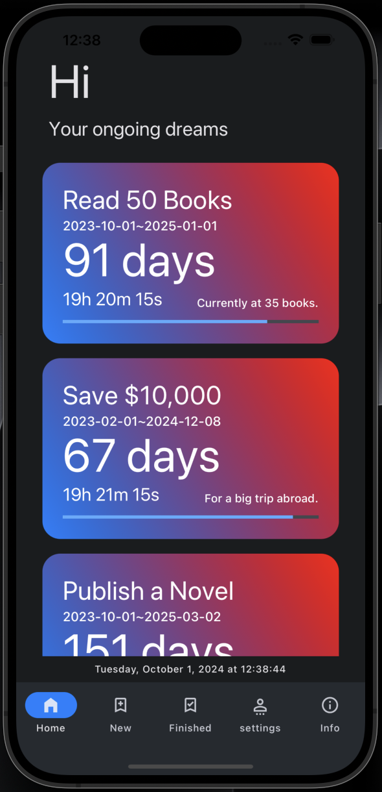
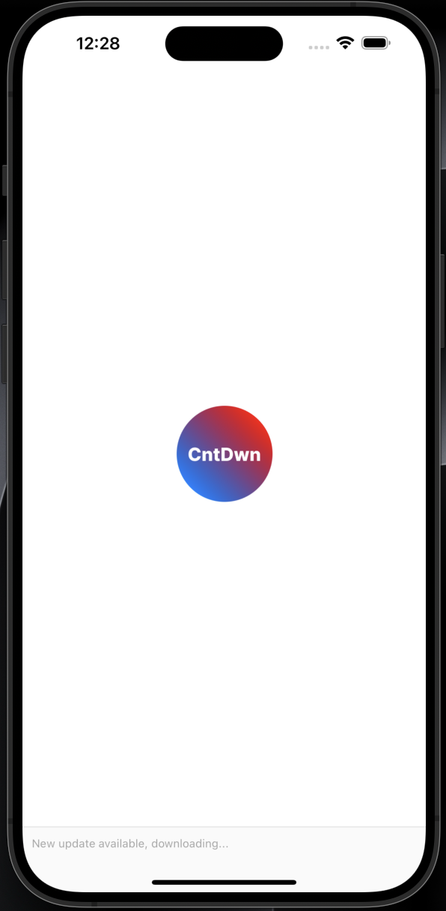
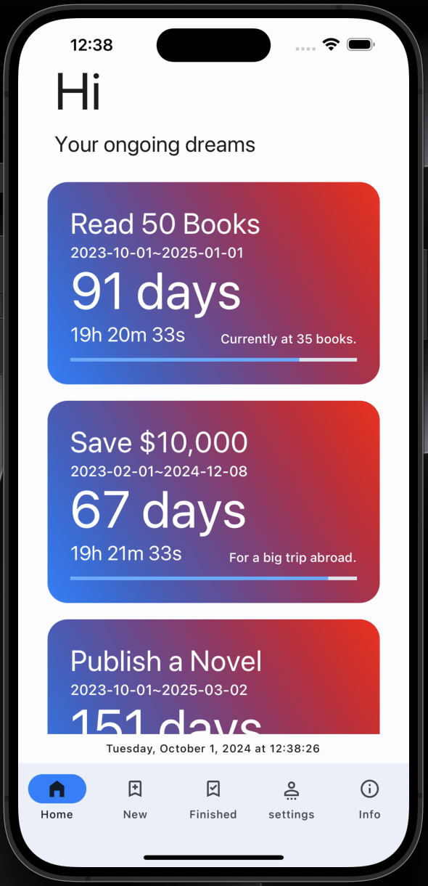

# CntDwn

CountDown app helps you keep track of your dreams and goals and how much time you have left.



## Installation

You can download the compiled version of this project for android here <a href="https://github.com/Maxhu787/Cnt-Dwn/blob/main/android-build.apk">download</a>
<br/>or build it yourself below for ios and web

## Build Guide

### Setup

```bash
git clone https://github.com/Maxhu787/Cnt-Dwn.git
```

```bash
cd cnt-dwn
npm install
```

#### android

```bash
eas build --local --profile production --platform android
```

#### ios

```bash
eas build --local --profile production --platform ios
```

#### web

```bash
npx expo export --platform web
```

# info

By <a href="https://maxhu787.github.io/">Hu Kaixiang</a> during 2024 9/22 ~ 10/1<br/>
https://buymeacoffee.com/g4o2<br/>
Ethereum: 0x6E6E2561cCfBB0CE08Ed28516c34a278ec18d6D6
